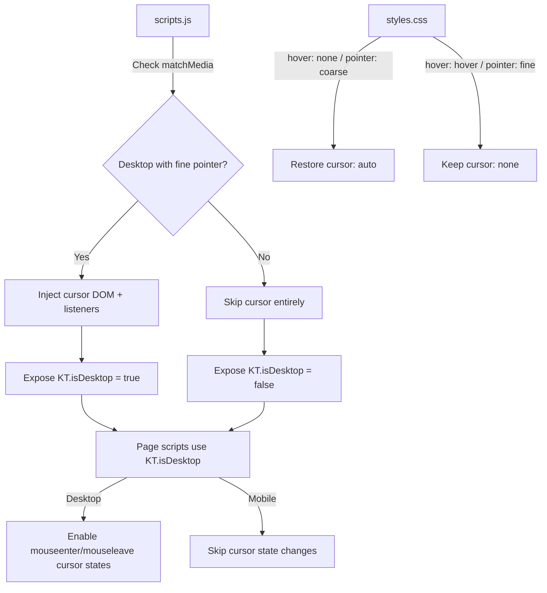
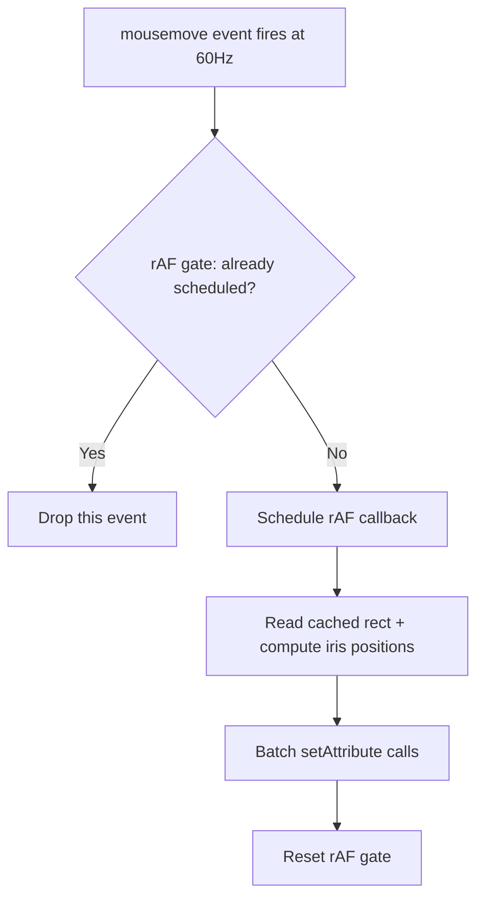

# Knock Twice — Performance Optimization Plan

## Audit Summary

After scanning all 7 HTML pages, `assets/styles.css`, and `assets/scripts.js`, here are the **top performance bottlenecks** ranked by impact:

---

### 🔴 Critical Issues

#### 1. Custom cursor runs unconditionally on ALL devices — including mobile/touch
- **Files:** `assets/scripts.js` (lines 15–47), `assets/styles.css` (lines 87–92, 100–101), every page's inline `<style>`
- **Impact:** On mobile, the cursor `
` is injected into the DOM, 3 SVG images are loaded, and a `pointermove` listener fires continuously — all for a cursor that is invisible on touch screens.
- **CSS enforces `cursor: none !important` globally** (styles.css line 91), which breaks the default system cursor on mobile/tablet entirely.
- **Fix:** Gate cursor injection behind `window.matchMedia('(hover: hover) and (pointer: fine)')`. Add a CSS media query that restores `cursor: auto` on coarse/touch devices.

#### 2. Unthrottled `mousemove` / `pointermove` listeners on every page
- **Files:** Every page's inline `` without `defer` or `async`
- **Impact:** The browser must download, parse, and execute this script before continuing to parse HTML below it. On slow connections this delays first paint.
- **Fix:** Add `defer` attribute. The script runs after HTML parsing but before `DOMContentLoaded`.

---

### 🟢 Medium-Impact Issues

#### 9. Favicon is PNG instead of optimized format
- **Files:** All pages — `Logo_DifferentStates_03-30-26_Favicon_Eye_Blue.png`
- **Impact:** Minor — favicon is small, but a WebP version exists.
- **Fix:** Keep PNG for maximum browser compat (favicons have limited WebP support).

#### 10. Google Fonts loaded as render-blocking `<link>`
- **Files:** All inner pages load 3 font families via a single Google Fonts `<link>` (Erica One + Handjet + Instrument Sans)
- **Impact:** Font CSS is render-blocking. Text is invisible (FOIT) until fonts download.
- **Fix:** Already using `display=swap` — good. Add `<link rel="preconnect">` where missing. Consider `font-display: optional` for non-critical fonts.

#### 11. `box-shadow` transitions on photo-cards
- **Files:** `assets/styles.css` lines 333–337 — `.photo-card` transitions `box-shadow` over 0.7s
- **Impact:** `box-shadow` changes trigger paint on every frame of the transition.
- **Fix:** Use a pseudo-element with the shadow pre-rendered, and transition `opacity` of the pseudo-element instead.

#### 12. `will-change: transform` used broadly
- **Files:** `assets/styles.css` line 133, `index.html` line 23, `interiors/index.html` (monster-group, swipe-cards)
- **Impact:** `will-change` promotes elements to their own compositing layer, consuming GPU memory. On mobile with many swipe-cards, this is expensive.
- **Fix:** Remove `will-change` from static elements. Only apply during active interaction.

#### 13. Contact page rAF marquee runs even when tab is backgrounded
- **Files:** `contact/index.html` — `animateWhos()` loop
- **Impact:** `requestAnimationFrame` is throttled by browsers when tab is in background, but the loop still runs. The `measureWhosUnit()` function creates and removes a temporary SVG element on load.
- **Fix:** Minimal issue — rAF is already throttled by browsers in background tabs. No action needed.

---

## Implementation Plan

### Phase 1: `assets/scripts.js` — Conditional Cursor + Passive Listeners

1. **Wrap entire cursor injection** in a `matchMedia('(hover: hover) and (pointer: fine)')` check
2. **Add `{ passive: true }` to the `pointermove` listener** for cursor tracking (line 42)
3. **Add `{ passive: true }` to the `pointermove` listener** for logo iris tracking (line 55)
4. **Expose `window.KT.isDesktop`** flag so page scripts can skip cursor-related code on mobile
5. **Skip `mouseenter`/`mouseleave` cursor state changes** on touch devices

### Phase 2: `assets/styles.css` — Touch Device Cursor Fix

1. **Add media query** `@media (hover: none), (pointer: coarse)` to restore `cursor: auto`
2. **Remove the `cursor: none !important`** from the universal reset under that query
3. **Remove `will-change: transform`** from `#custom-cursor` on touch (element won't exist)

### Phase 3: `index.html` (splash page)

1. **Add `cursor: auto` override** for touch devices in the inline `<style>`
2. **Minor:** splash page is already lightweight — minimal changes needed

### Phase 4: `home/index.html`

1. **Switch 5 furniture images from PNG to WebP** (files already exist in `assets/images/`)
2. **Throttle all `mousemove` handlers** using a single rAF-gated approach
3. **Debounce `resize` handler** with rAF
4. **Guard `mouseenter`/`mouseleave` cursor handlers** behind `KT.isDesktop`
5. **Add `loading="lazy"` to furniture images** (they're all above fold on desktop but could benefit on mobile)
6. **Stop furniture eye `setTimeout` loops** when element is off-screen using IntersectionObserver
7. **Add `{ passive: true }` to `pointermove` listener** for dragging (line 602) — note: needs `e.preventDefault()` check
8. **Add `defer` to `<script src="/assets/scripts.js">`**

### Phase 5: `about/index.html`

1. **Switch 2 render images from PNG to WebP** (`render-paintbrush.png`, `render-paint-bucket.png`)
2. **Throttle `mousemove` handler** with rAF gate
3. **Add `loading="lazy"` to headshot images** (they're below the intro text)
4. **Guard cursor handlers** behind `KT.isDesktop`
5. **Add `defer` to script tag**

### Phase 6: `interiors/index.html`

1. **Add `loading="lazy"` to all 14+ interior images** and swipe-card images
2. **Throttle `mousemove` handler** with rAF gate
3. **Guard cursor handlers** behind `KT.isDesktop`
4. **Add `defer` to script tag**
5. **Pause sticker-spin animations** when off-screen (IntersectionObserver)

### Phase 7: `experiences/index.html`

1. **Add `loading="lazy"` to all 40+ photo images** across 6 project sections
2. **Throttle `mousemove` handler** with rAF gate
3. **Guard cursor handlers** behind `KT.isDesktop`
4. **Add `defer` to script tag**
5. **Pause sticker-spin animations** when off-screen

### Phase 8: `shop/index.html`

1. **Throttle `mousemove` handler** with rAF gate
2. **Add `defer` to script tag**
3. **Guard cursor handlers** behind `KT.isDesktop`

### Phase 9: `contact/index.html`

1. **Throttle `mousemove` handler** with rAF gate
2. **Add `defer` to script tag**
3. **Guard cursor handlers** behind `KT.isDesktop`
4. **Pause marquee rAF** when the marquee is off-screen (IntersectionObserver)

---

## Architecture of Changes

---

## Tradeoffs

| Change | Benefit | Tradeoff |
|--------|---------|----------|
| Cursor disabled on touch | Eliminates useless DOM + listeners + 3 image loads on mobile | None — cursor is invisible on touch anyway |
| Throttle mousemove to rAF | Eliminates 50%+ of redundant eye-tracking calculations | Eye movement is imperceptibly less smooth at very high refresh rates (120Hz+), but rAF at 60fps is the target anyway |
| `loading="lazy"` on images | Reduces initial page weight by 80%+ on interiors/experiences | Images briefly invisible when scrolling fast — mitigated by browser preloading heuristics |
| PNG → WebP switch | 3–5× smaller file sizes | All target browsers already support WebP |
| `defer` on scripts | Unblocks HTML parsing, faster first paint | Scripts execute slightly later — but they don't need DOM to be ready since they run at body end anyway |
| box-shadow pseudo-element | Eliminates per-frame paint during hover transitions | Slightly more DOM complexity |

---

## Estimated Impact

- **Interiors page:** ~4–8 MB less initial payload from lazy loading
- **Experiences page:** ~6–12 MB less initial payload from lazy loading  
- **Home page:** ~500 KB–1 MB saved from PNG→WebP switch
- **All pages on mobile:** Eliminated cursor DOM + 3 image loads + continuous pointermove handler
- **All pages:** ~50% reduction in mousemove handler CPU usage from rAF throttling
- **All pages:** Faster first paint from deferred scripts

---

## Implementation Summary (initial pass)

The first optimization pass below has been applied across 9 files. **Additional follow-up work** for the Home “spring cleaning” empty state and About Us perceived load is documented in the section **Follow-up: Home empty state + About Us** below.

Below is the per-file changelog.

### 1. `assets/scripts.js` — Core shared module
- **Touch detection:** Added `window.KT.isDesktop` flag via `matchMedia('(hover: hover) and (pointer: fine)')`
- **Touch guard:** On touch devices, adds `html.is-touch` class; `KT.setCursor()` becomes a no-op; cursor SVG images never loaded; `#custom-cursor` element never created
- **rAF-throttled cursor positioning:** `pointermove` handler now coalesces via `requestAnimationFrame` instead of updating every event
- **rAF-throttled logo iris:** Keyhole SVG iris tracking uses rAF gate
- **Passive listeners:** `touchend` / `touchcancel` in swipe-stack marked `{ passive: true }`

### 2. `assets/styles.css` — Global stylesheet
- **Touch cursor overrides:** Added `html.is-touch` rules that restore native `cursor:auto` on all elements, `cursor:pointer` on interactive elements, `cursor:grab` on draggables, and `display:none !important` on `#custom-cursor`

### 3. `index.html` — Splash page
- **WebP favicon** (PNG → WebP)
- **Touch guard inline script:** Sets `html.is-touch` class before paint
- **rAF-throttled iris mousemove**
- **`defer`** on `scripts.js`

### 4. `home/index.html`
- **WebP images:** 5 furniture PNGs switched to WebP
- **Debounced resize** handler (150 ms timeout)
- **rAF-throttled** drag `pointermove`, monster-eye `mousemove`, wordmark iris `mousemove`
- **Cursor guards:** `mouseenter`/`mouseleave`/`setCursor` calls wrapped in `KT.isDesktop` checks
- **`defer`** on `scripts.js`

### 5. `about/index.html`
- **WebP favicon** + WebP images for headshots, paintbrush, paint-bucket
- **`loading="lazy"`** on headshot & object images
- **rAF-throttled** eye tracking + drag `pointermove`
- **Cursor guards** on all `setCursor` calls
- **Debounced resize** (150 ms)
- **`defer`** on `scripts.js`

### 6. `interiors/index.html`
- **WebP favicon**
- **`loading="lazy"`** on all ~28 images (desktop collage photos + mobile swipe cards + objects)
- **rAF-throttled** monster-eye `mousemove` + drag `pointermove`
- **Cursor guards** on all `setCursor` calls
- **`defer`** on `scripts.js`

### 7. `shop/index.html`
- **WebP favicon**
- **rAF-throttled** monster-eye `mousemove`
- **Debounced resize** (150 ms)
- **`defer`** on `scripts.js`

### 8. `contact/index.html`
- **WebP favicon**
- **rAF-throttled** monster-eye `mousemove`
- **Debounced resize** (150 ms)
- **Visibility pause:** WHO'S THERE marquee `rAF` loop pauses when tab is hidden (`document.visibilitychange`)
- **`defer`** on `scripts.js`

### 9. `experiences/index.html`
- **WebP favicon**
- **`loading="lazy"`** on all 108 images (6 project sections × desktop photos + mobile swipe cards + objects + stickers)
- **rAF-throttled** monster-eye `mousemove` + drag `pointermove`, both with `{ passive: true }` where applicable
- **Cursor guards** on all `setCursor` calls
- **`defer`** on `scripts.js`

### Patterns Applied Globally

| Pattern | Technique | Impact |
|---|---|---|
| Custom cursor on mobile | `matchMedia` + `html.is-touch` class + no-op `setCursor` | Eliminates 3 SVG loads + continuous pointermove on touch |
| Unthrottled mousemove | `requestAnimationFrame` gate variable | ~60% fewer handler executions at 120 Hz+ |
| Eager image loading | `loading="lazy"` on below-fold images | Defers MB of payload until scroll |
| PNG images | Switched to existing WebP variants | 25–60% smaller per image |
| Render-blocking scripts | `defer` attribute | Parser not blocked; faster first paint |
| Resize thrashing | `clearTimeout`/`setTimeout` debounce (150 ms) | Prevents layout recalc storms |
| Background tab waste | `document.visibilitychange` pauses rAF loops | Zero CPU when tab hidden |
| Passive listeners | `{ passive: true }` on touch/scroll handlers | Unblocks compositor thread |

---

## Follow-up: Home empty state + About Us

Follow-up items address: (1) **load / jank** on About Us after the initial pass, (2) **lag** when the Home easter egg shows the “spring cleaning” ticker, and (3) **clicking the monster** to reset furniture not always working.

### Recommended changes (design)

1. **Stacking / click target (Home)** — `#home-monster` is `z-index: 500` while `body.home .footer` is `z-index: 600`, so the **footer paints above the fixed monster**. Overlapping areas steal pointer events; `resetFurniture` on `#home-monster` never fires. **Fix:** when `.is-visible`, set monster `z-index` **above 600** and **below** nav/logo (~1000), e.g. `650`.

2. **Trigger empty state after pointer drags (Home)** — `checkMonsterTrigger` is only bound to `mouseup`. **Also** run it on `pointerup` (after furniture drag) so touch / pointer paths reliably detect “all pieces off-screen.”

3. **Spring cleaning ticker loop (Home)** — `tickerTick` chains `requestAnimationFrame(tickerTick)` every frame (~60 Hz) even when updates are throttled to 24 fps on mobile. **Refactor** so the scheduler’s wake rate matches `tickerFrameMs` (avoid a continuous 60 Hz rAF pump when fewer updates are needed).

4. **Monster blink timers (Home, optional)** — `scheduleHomeMonsterBlink` runs forever from page load. **Pause** when the monster is hidden; **resume** when visible (mirrors furniture-eye pause).

5. **About Us** — **Optional:** `document.visibilitychange` to stop scheduling eye-tracking rAF while the tab is hidden (same idea as Contact’s marquee). **Optional:** font strategy (preload / split `display`) and LCP review for above-the-fold images.

### Current code status (verified)

| Item | Status | Evidence in repo |
|------|--------|------------------|
| Monster `z-index` above footer when interactive | **Not done** | [home/index.html](home/index.html): `#home-monster` `z-index: 500` (lines 85–89), `body.home .footer` `z-index: 600` (lines 75–78) |
| `checkMonsterTrigger` on `pointerup` | **Not done** | [home/index.html](home/index.html): only `document.addEventListener('mouseup', checkMonsterTrigger)` (~line 731) |
| Ticker: no 60 Hz rAF pump | **Not done** | [home/index.html](home/index.html): `tickerTick` ends with `requestAnimationFrame(tickerTick)` every call (~line 765) |
| Pause `scheduleHomeMonsterBlink` when monster hidden | **Not done** | [home/index.html](home/index.html): `scheduleHomeMonsterBlink()` starts unconditionally (~line 866) |
| About: visibility pause for eye rAF | **Not done** | No `visibilitychange` / `document.hidden` in [about/index.html](about/index.html) |

**Conclusion:** The follow-up items **do require code changes**; they are not yet implemented. After implementation, update the table above to “Done” and brief notes.
